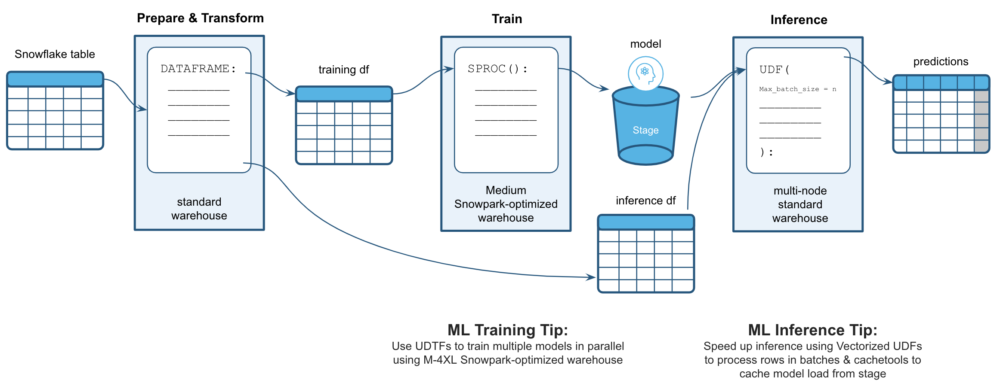

# Snowpark PyCon 2023 Berlin
Supporting materials for my presentation about Snowpark at PyCon2023.

## Abstract
[Snowflake](https://www.snowflake.com/en/) as a data platform is the core data repository of many large organizations.  
With the introduction of Snowflake's [Snowpark for Python](https://github.com/snowflakedb/snowpark-python), Python developers can now collaborate and build on one platform with a secure Python sandbox, providing developers with dynamic scalability & elasticity as well as security and compliance.  

In this talk I'll explain the core concepts of <b>Snowpark for Python</b> and how they can be used for <b>large scale feature engineering</b> and <b>data science</b>.

## Contents
This talk is for technical people that would like to get a deep dive into how Snowflake enables large scale feature engineering and data science via <b>Snowpark for Python</b>.  
During this talk we'll explore Snowflake's Python capabilities using a simple machine learning use case.

After this talk you will:
* know how Snowpark avoids data movement and keeps existing security & governance intact,
* understand the concept of the Snowpark DataFrame-API and how it enables accelerated performance compared to standard Pandas DataFrames,
* know how to distribute Hyper Parameter Tuning and training of multiple models,
* understand the concept of Vectorized User-Defined-Functions and how they can be used to perform large scale model inference.

## What you'll build

## Requirements
* A free [Snowflake Trial Account](https://signup.snowflake.com/)
* Anaconda Integration enabled by ORGADMIN ([Doc](https://docs.snowflake.com/en/developer-guide/udf/python/udf-python-packages#getting-started))
* Python 3.8
* Some Python IDE (e.g. VSCode)
* (Optional for notebook 3) SnowML PrPr

## Contact
michael.gorkow@snowflake.com  
[LinkedIn](https://www.linkedin.com/in/michael-gorkow/)